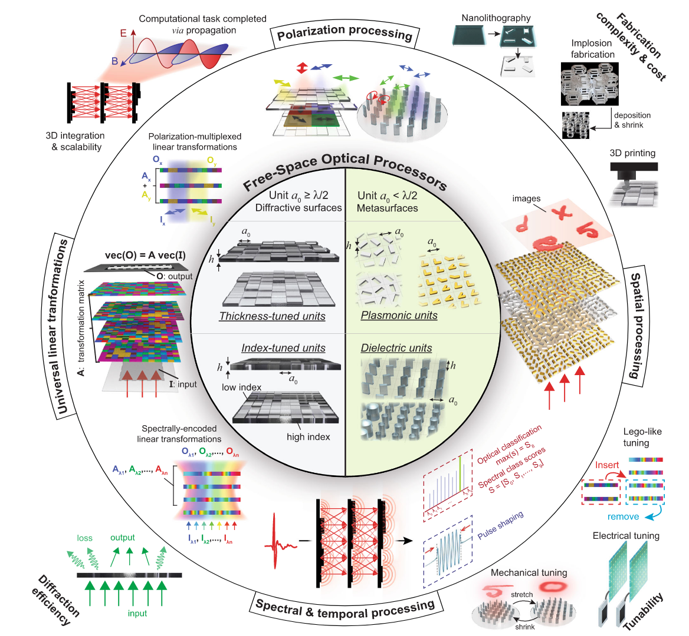
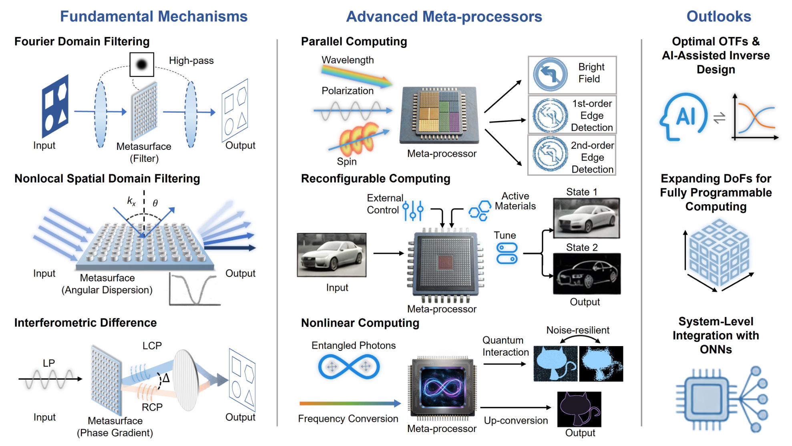
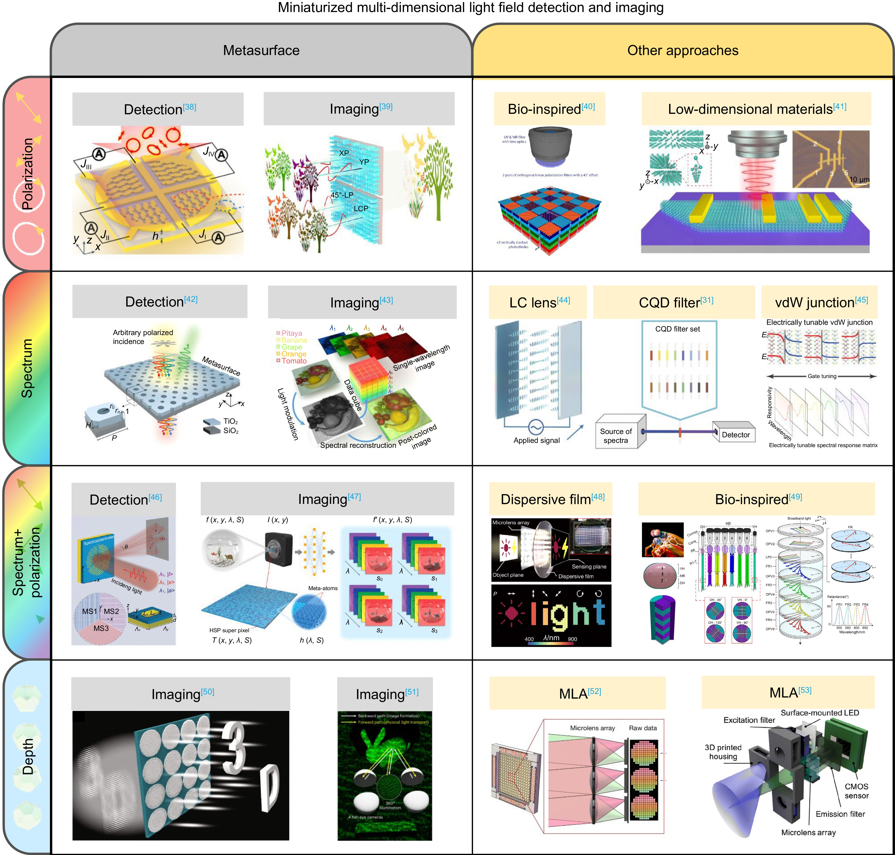

# 李效欣（Li Xiaoxin）

{width=220 fig-align="left"}

李效欣，物理学博士，哈尔滨工业大学物理学院本硕博，研究方向是超表面光计算与光感知芯片。

## Research Interests

- 超构表面（Metasurfaces）
- 自由空间光计算（Free Space Optical Computing）
- 多维度计算成像（Multi-Demonsion Computational Imaging）
- 结构光场调控（Structured Light Field Modulation）
- 集成超构芯片/传感器（Integrated Meta-optics Chip/Sensor）

## Selected Topics

### Metasurface-enabled optical computing

{width=75% fig-align="center"}

Using metasurfaces for optical encoding and task-oriented information processing.

### Incoherent optical differentiation and convolution
{width=75% fig-align="center"}

Exploring optical computation under practical incoherent illumination conditions.

### High-dimensional imaging and sensing
{width=75% fig-align="center"}
Integrating metasurfaces with imaging sensors for spectral and polarization reconstruction.

## Quick Links

- [Google Scholar](https://scholar.google.com.hk/citations?user=_G05MfUAAAAJ&hl=zh-CN)
- [Researcher](https://www.researchgate.net/profile/Xiaoxin-Li-6?ev=hdr_xprf&_sg=JUNKMKhjpxFbX-5xgV99mvJlWoU0jdbP2OFqy7NxhnftYDElqhuvNqSjdpWVzAz6PxHIX9NVk4VnxhVCUPlPHMwQ&_tp=eyJjb250ZXh0Ijp7ImZpcnN0UGFnZSI6ImhvbWUiLCJwYWdlIjoiaG9tZSIsInBvc2l0aW9uIjoiZ2xvYmFsSGVhZGVyIn19)
- [Download CV](assets/pdf/CV-lxx.pdf)