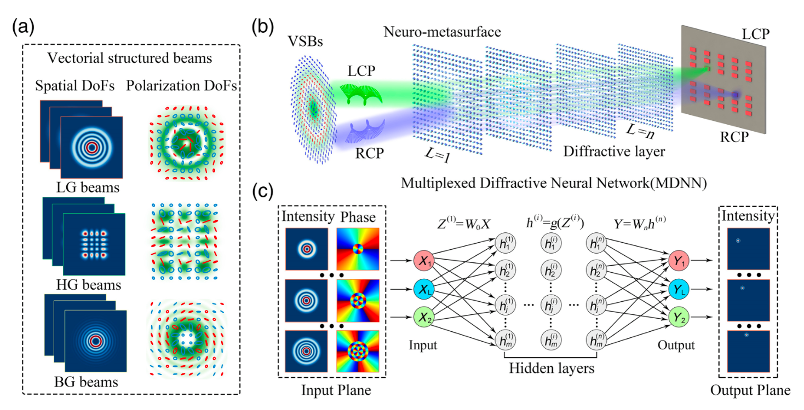
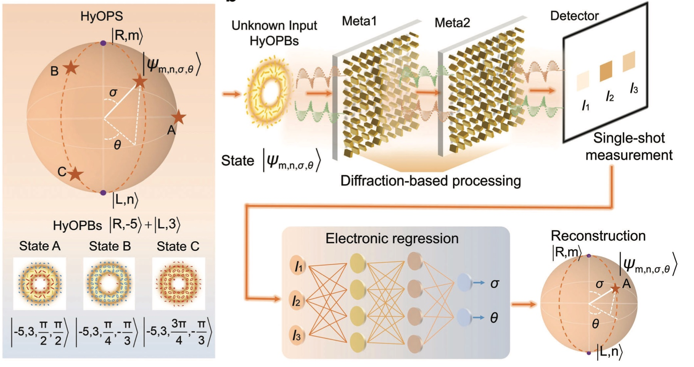
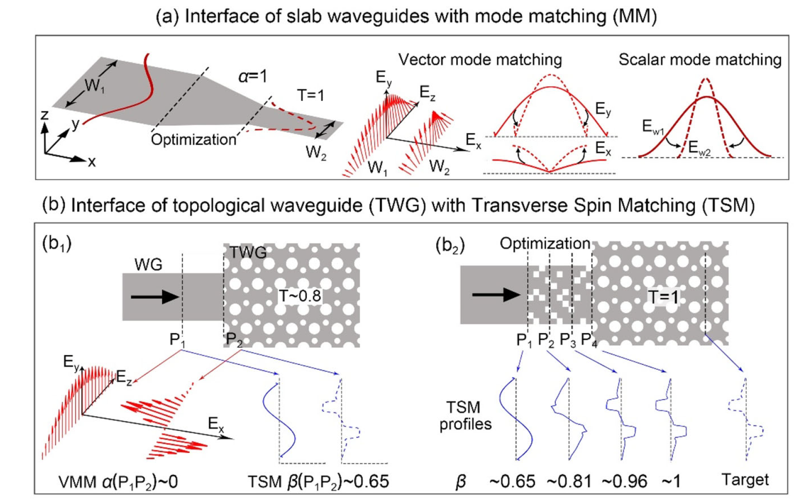
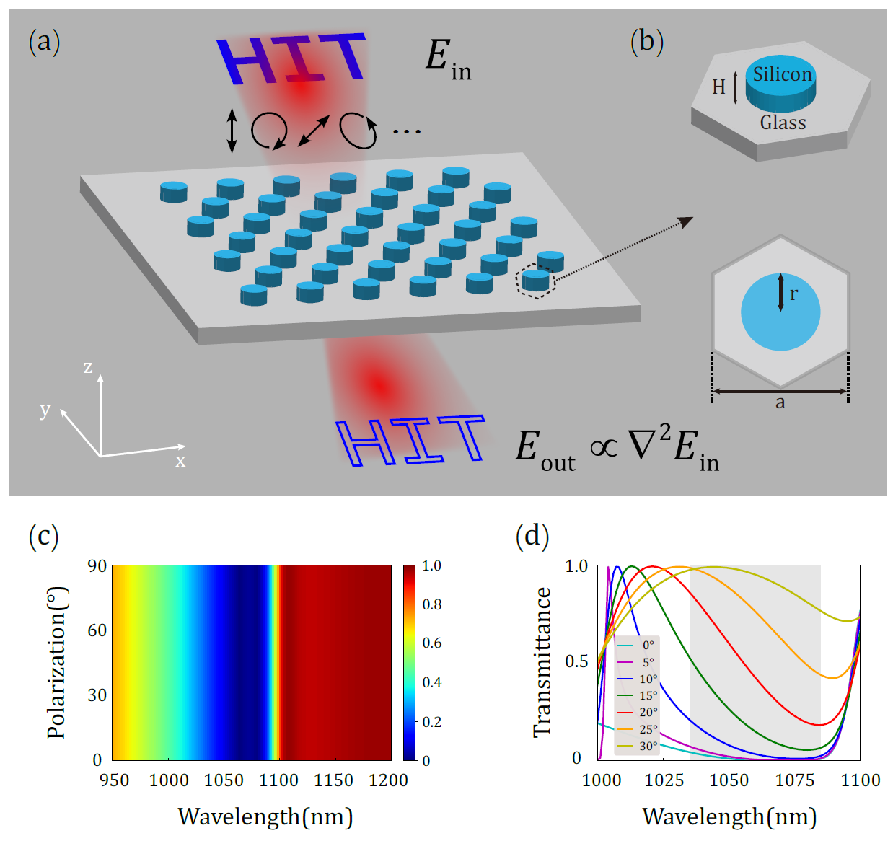

Selected representative works are highlighted below.

## Selected Publications（论文）

### 1. [Simultaneous Sorting of Arbitrary Vector Structured Beams with Spin-Multiplexed Diffractive Metasurfaces](assets/pdf/Simultaneous sorting of arbitrary vector structured beams with spin-multiplexed.pdf)

*Xiaoxin Li*, et al. Advanced Photonics Nexus, 2024, 3(3): 036010-036010.

**Summary:**  
A compact spin-multiplexed diffractive metasurface framework for simultaneous sorting and detection of arbitrary vector structured beams.

**Highlights:**  
{width=1000 fig-align="center"}

---

### 2. [Diffractive Metasurface-Enabled Single-Shot Characterization of Hybrid-Order Poincaré Beams](assets/pdf/Diffractive Metasurface-enabled Single-shot Characterization of Hybrid-Order Poincaré Beams.pdf)

*Xiaoxin Li*, et al. Advanced Optical Materials, 2025, 13(13): 2403405. 

**Summary:**  
A single-shot and real-time characterization strategy for hybrid-order Poincaré beams using cascaded diffractive metasurfaces and electronic neural networks.

**Highlights:**  
{width=1000 fig-align="center"}

---

---

### 3. Efficient Coupling of Topological Photonic Crystal Waveguides Based on Transverse Spin Matching Mechanism

Bojian Shi, Qi Jia, *Xiaoxin Li*, Nature Communications (2025) 

**Summary:**  
A transverse-spin-matching mechanism for efficient coupling between topological photonic crystal waveguides and conventional strip waveguides.

**Highlights:**  
{width=1000 fig-align="center"}

### 4. Polarization-Independent, High-NA Edge Detection with Nonlocal Metasurfaces

Yalong Liu, *Xiaoxin Li_#*, el al. Optics Letters, 2025, 50(11): 3517-3520. 

**Summary:**  
A nonlocal dielectric metasurface for polarization-independent optical edge detection with both high numerical aperture and broadband response.

**Highlights:**  
{width=1000 fig-align="center"}

---

### Bilayer Metasurface-Enabled High-Sensitivity Near-Infrared Computational Spectrometer

Juntong Chen, **Xiaoxin Li**, Bojian Shi, Qi Jia, Yanxia Zhang, Wenya Gao, Yanyu Gao, Wentong Shi, Yongyin Cao, Hongyan Shi, Fangkui Sun, Rui Feng, Weiqiang Ding

**Optics Communications (2025)**  
**DOI:** 10.1016/j.optcom.2025.132051

**Summary:**  
A bilayer metasurface computational spectrometer that combines spectral encoding and broadband achromatic focusing for high-sensitivity near-infrared sensing.

**Highlights:**  
- Ultra-compact footprint of only 21 × 21 μm  
- Sensitivity improved by about 60% compared with conventional structures  
- Spectral reconstruction fidelity reaches 93.5%  

## Patents(专利)

### Broadband Full-Stokes Polarization Imaging Device Based on Non-Orthogonal Four-Channel Polarization Splitting

**Status:** Patent application accepted  
**Application No.:** 202511764621.1  
**Application Date:** 2025-11-27  
**Applicant:** Harbin Institute of Technology  
**Inventors:** Ding Weiqiang, Li Xiaoxin, Feng Rui, Cao Yongyin, Sun Fangkui

A broadband full-Stokes polarization imaging device based on non-orthogonal four-channel polarization splitting.

---

### Polarization-State Characterization Method for Hybrid-Order Poincaré Beams Based on Diffractive Metasurfaces

**Status:** Patent application accepted  
**Application No.:** 202510183871.X  
**Application Date:** 2025-02-19  
**Applicant:** Harbin Institute of Technology  
**Inventors:** Li Xiaoxin, Feng Rui, Shi Bojian, Ding Weiqiang, Sun Fangkui

A diffractive-metasurface-based method for polarization-state characterization of hybrid-order Poincaré beams.

---

### Pixel-Level High-Efficiency Visible Bayer Color Filter Based on Metalens / Metasurface

**Status:** Patent application accepted  
**Application No.:** 202211486566.0  
**Application Date:** 2022-11-24  
**Applicant:** Harbin Institute of Technology

A pixel-level high-efficiency visible Bayer color filter based on a metalens / metasurface architecture.

---
