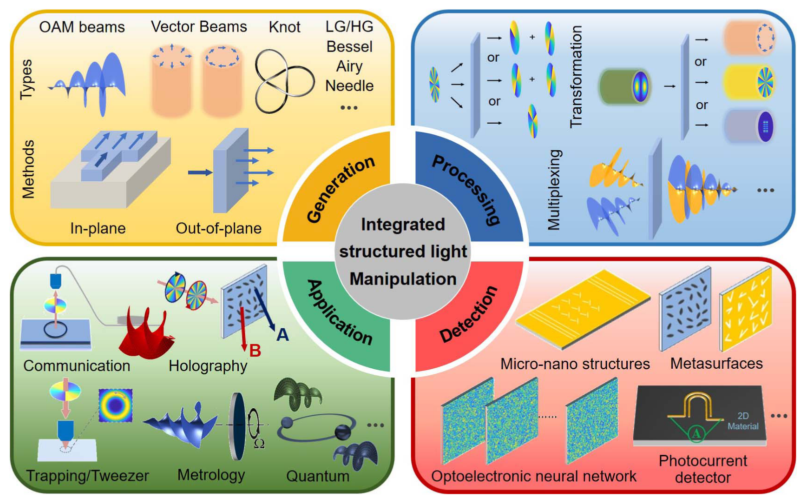

# About Me（个人简介）

李效欣，物理学博士，目前于杭州北京航天航空大学国际创新研究院绿色光子国际研究中心从事博士后研究。本、硕和博士均毕业于哈尔滨工业大学物理学院，博士生导师为丁卫强教授。毕业后加入北航国新院从事博士后，合作导师为王浩教授。
研究领域聚焦于纳米光子学，主要包括基于超表面的多维度并行光计算、超表面集成的高维光场感知芯片与超表面多维度光场调控等，近年来发表论文20余篇，包括Nature Communications、ACS Photonics、Advanced Optical Materials、Advanced photonics Nexus等，申请及授权相关发明专利8项，多次参与中国国际大学生创新大赛并获得金奖等。

# Research Topics（研究领域）

## 1. Metasurface-enabled Optical Computing

{width=75% fig-align="center"}

Using metasurfaces and diffractive neural networks for multidimensional, high-capacity, and parallel optical information processing.
该方向面向光计算与智能信息处理需求，研究基于超表面的光学计算架构，重点包括衍射神经网络、任务驱动光学编码以及多维度光信息并行处理等内容。通过设计具有特定传递特性的超表面器件，将光场调控、特征提取与计算功能前移至物理层，实现对幅度、相位、偏振、波长等多维信息的联合编码与处理。该方向致力于突破传统电子计算在功耗、并行度和数据吞吐方面的限制，为高容量、低能耗和高速并行的光学信息处理提供新方案。

## 2. Structured Light Field Manipulation and Detection

{width=75% fig-align="center"}

Generating, controlling, and detecting complex structured light fields, including vortex beams, vector optical fields, and optical skyrmions.
该方向聚焦复杂结构光场的产生、调控与探测，重点研究涡旋光束、矢量光场以及光学斯格明子等特殊光场的物理构建方法、传播调控机制及其信息表征方式。通过超表面与衍射光学器件，实现对光场轨道角动量、自旋角动量、空间偏振纹理及拓扑特征的精确控制，并进一步发展面向复杂结构光场的高效检测与解码方法。该方向面向高维光通信、拓扑光子学、精密测量和新型信息编码等场景拓展。

## 3. Incoherent Optical Differentiation and Convolution

{width=75% fig-align="center"}

Exploring optical differentiation and convolution under practical incoherent illumination conditions..
该方向面向实际成像与视觉感知场景中的非相干照明条件，研究非相干光学微分、卷积计算及其在图像边缘增强、特征提取和目标识别中的应用。不同于依赖相干干涉的传统光计算方法，该方向更加关注与自然光、宽带照明和常规成像系统兼容的计算架构，通过设计超表面的空间频率响应与等效光学传递函数，实现高阶微分、卷积核并行输出以及任务相关的光学预处理功能。该方向旨在推动光计算从理想实验条件走向真实成像环境，为低功耗、实时化、片上化视觉前端提供支撑。

## 4. High-dimensional Imaging and Sensing

{width=75% fig-align="center"}

Integrating metasurface encoders with image sensors for multidimensional optical field sensing and imaging, including depth, 3D, spectral, and polarization information.
该方向面向新型智能成像芯片与多维光场感知需求，研究将超表面编码器直接集成到图像传感器前端，实现深度、三维形貌、光谱、偏振等多维信息的压缩编码探测与计算成像重建。通过在像面或近像面位置引入具有特定调制特性的超表面结构，可在硬件层面对入射光场进行高维编码，再结合重建算法或神经网络实现多维信息的单次快照恢复。该方向致力于突破传统成像系统在体积、维度、速度和成本方面的限制，为高集成度、轻量化、智能化的多维成像与传感系统提供新路径。
